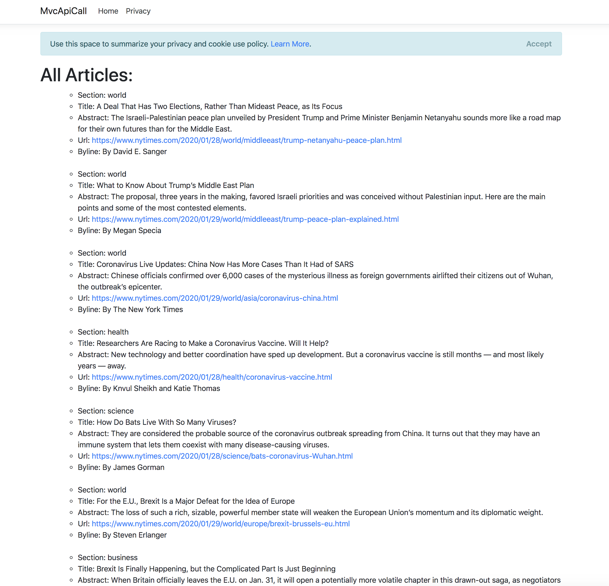

# MVC API Call - New York Times

#### _C#, .NET: MVC API Call - New York Times, 01/29/2020_

## Description
Create .NET MVC application with API call with RestSharp.



## Application specifications:
- New York Times API
    - Get a API key for Top Stories API from [New York Times developer account](https://developer.nytimes.com/)

    - Create a EnvironmentVariables.cs in MvcApiCall/Models and paste the API key in the code:
    ```
    namespace MvcApiCall.Models
    {
        public static class EnvironmentVariables
        {
            public static string ApiKey = "paste-api-key-here";
        }
    }
    ```


## Setup/Installation Requirements

1. Clone this repo:
```
$ git clone this-project-url
```

2. Make sure you have added a EnvironmentVariables.cs in MvcApiCall/Models with your api key


3. Run application
```
$ dotnet run
```

## Known Bugs
* No known bugs at this time.

## Support and contact details
misaki.koonce@gmail.com

tismetrm@gmail.com


## Technologies Used
C# and ASP.NET Core MVC, MySQL and Entity Framework

## License
Copyright © 2020 under the MIT License